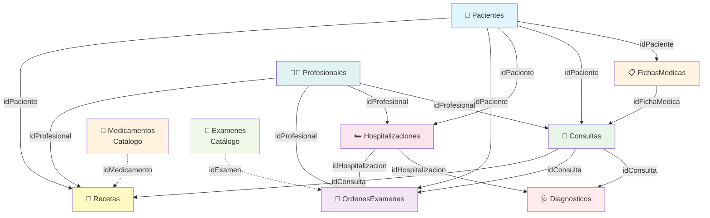

# Esquema de Base de Datos Firestore - Sistema Médico Nexus

## Diagrama de Colecciones



---

## 📊 Colecciones Principales

### 1. 👤 **pacientes**
Información demográfica y médica básica de los pacientes.

| Campo | Tipo | Descripción |
|-------|------|-------------|
| `id` | string | ID único del documento |
| `rut` | string | RUT del paciente |
| `nombre` | string | Nombre del paciente |
| `apellido` | string | Apellido del paciente |
| `fechaNacimiento` | Timestamp | Fecha de nacimiento |
| `direccion` | string | Dirección de residencia |
| `telefono` | string | Teléfono de contacto |
| `email` | string (opcional) | Correo electrónico |
| `sexo` | 'M' \| 'F' \| 'Otro' | Sexo del paciente |
| `grupoSanguineo` | string (opcional) | Grupo sanguíneo |
| `alergias` | string[] (opcional) | Lista de alergias |
| `enfermedadesCronicas` | string[] (opcional) | Enfermedades crónicas |
| `alertasMedicas` | AlertaMedica[] (opcional) | Alertas médicas importantes |
| `nombreCompleto` | string (opcional) | Nombre completo para búsquedas |
| `createdAt` | Timestamp | Fecha de creación |
| `updatedAt` | Timestamp | Última actualización |

**Sub-interfaces:**
```typescript
AlertaMedica {
  tipo: 'alergia' | 'enfermedad_cronica' | 'medicamento_critico' | 'otro'
  descripcion: string
  severidad: 'baja' | 'media' | 'alta' | 'critica'
  fechaRegistro: Timestamp
}
```

---

### 2. 📋 **fichas-medicas**
Ficha médica general de cada paciente con antecedentes.

| Campo | Tipo | Descripción |
|-------|------|-------------|
| `id` | string | ID único del documento |
| `idPaciente` | string | **FK → pacientes.id** |
| `fechaMedica` | Timestamp | Fecha de apertura de la ficha |
| `observacion` | string (opcional) | Observaciones generales |
| `antecedentes` | object (opcional) | Antecedentes médicos |
| `totalConsultas` | number (opcional) | Contador de consultas |
| `ultimaConsulta` | Timestamp (opcional) | Fecha de última consulta |
| `createdAt` | Timestamp | Fecha de creación |
| `updatedAt` | Timestamp | Última actualización |

**Sub-objetos:**
```typescript
antecedentes {
  familiares?: string
  personales?: string
  quirurgicos?: string
  hospitalizaciones?: string
  alergias?: string[]
}
```

---

### 3. 🏥 **consultas**
Registro de consultas médicas realizadas a pacientes.

| Campo | Tipo | Descripción |
|-------|------|-------------|
| `id` | string | ID único del documento |
| `idPaciente` | string | **FK → pacientes.id** |
| `idProfesional` | string | **FK → profesionales.id** |
| `idFichaMedica` | string | **FK → fichas-medicas.id** |
| `fecha` | Timestamp | Fecha de la consulta |
| `motivo` | string | Motivo de consulta |
| `tratamiento` | string (opcional) | Tratamiento indicado |
| `observaciones` | string (opcional) | Observaciones adicionales |
| `notas` | NotaRapida[] (opcional) | Notas rápidas |
| `createdAt` | Timestamp | Fecha de creación |
| `updatedAt` | Timestamp | Última actualización |

**Sub-interfaces:**
```typescript
NotaRapida {
  texto: string
  autor: string  // ID del profesional
  fecha: Timestamp
}
```

---

### 4. 🛏️ **hospitalizaciones**
Registro de hospitalizaciones de pacientes.

| Campo | Tipo | Descripción |
|-------|------|-------------|
| `id` | string | ID único del documento |
| `idPaciente` | string | **FK → pacientes.id** |
| `idProfesional` | string | **FK → profesionales.id** |
| `fechaIngreso` | Timestamp | Fecha de ingreso |
| `fechaAlta` | Timestamp (opcional) | Fecha de alta |
| `habitacion` | string (opcional) | Número de habitación |
| `motivoIngreso` | string | Motivo de hospitalización |
| `observaciones` | string (opcional) | Observaciones |
| `intervencion` | string[] (opcional) | Intervenciones realizadas |
| `createdAt` | Timestamp | Fecha de creación |
| `updatedAt` | Timestamp | Última actualización |

---

### 5. 🩺 **diagnosticos**
Diagnósticos asociados a consultas u hospitalizaciones.

| Campo | Tipo | Descripción |
|-------|------|-------------|
| `id` | string | ID único del documento |
| `idConsulta` | string (opcional) | **FK → consultas.id** |
| `idHospitalizacion` | string (opcional) | **FK → hospitalizaciones.id** |
| `codigo` | string | Código CIE-10 u otro sistema |
| `descripcion` | string | Descripción del diagnóstico |
| `tipo` | 'principal' \| 'secundario' (opcional) | Tipo de diagnóstico |
| `createdAt` | Timestamp | Fecha de creación |
| `updatedAt` | Timestamp | Última actualización |

---

### 6. 🔬 **ordenes-examenes**
Órdenes de exámenes solicitadas a pacientes.

| Campo | Tipo | Descripción |
|-------|------|-------------|
| `id` | string | ID único del documento |
| `idPaciente` | string | **FK → pacientes.id** |
| `idProfesional` | string | **FK → profesionales.id** |
| `idConsulta` | string (opcional) | **FK → consultas.id** |
| `idHospitalizacion` | string (opcional) | **FK → hospitalizaciones.id** |
| `fecha` | Timestamp | Fecha de la orden |
| `estado` | 'pendiente' \| 'realizado' \| 'cancelado' | Estado de la orden |
| `examenes` | ExamenSolicitado[] | Exámenes solicitados |
| `createdAt` | Timestamp | Fecha de creación |
| `updatedAt` | Timestamp | Última actualización |

**Sub-interfaces:**
```typescript
ExamenSolicitado {
  idExamen: string  // FK → examenes.id
  nombreExamen: string
  resultado?: string
  fechaResultado?: Timestamp
  documentos?: DocumentoExamen[]
}

DocumentoExamen {
  url: string          // URL en Firebase Storage
  nombre: string       // Nombre del archivo
  tipo: string         // MIME type
  tamanio: number      // En bytes
  fechaSubida: Timestamp
  subidoPor: string    // ID del profesional
}
```

---

### 7. 💊 **recetas**
Recetas médicas emitidas a pacientes.

| Campo | Tipo | Descripción |
|-------|------|-------------|
| `id` | string | ID único del documento |
| `idPaciente` | string | **FK → pacientes.id** |
| `idProfesional` | string | **FK → profesionales.id** |
| `idConsulta` | string (opcional) | **FK → consultas.id** |
| `fecha` | Timestamp | Fecha de emisión |
| `medicamentos` | MedicamentoRecetado[] | Medicamentos recetados |
| `observaciones` | string (opcional) | Observaciones adicionales |
| `createdAt` | Timestamp | Fecha de creación |
| `updatedAt` | Timestamp | Última actualización |

**Sub-interfaces:**
```typescript
MedicamentoRecetado {
  idMedicamento: string  // FK → medicamentos.id
  nombreMedicamento: string
  dosis: string
  frecuencia: string
  duracion: string
  indicaciones?: string
}
```

---

### 8. 👨‍⚕️ **profesionales**
Información de profesionales de la salud.

| Campo | Tipo | Descripción |
|-------|------|-------------|
| `id` | string | ID único del documento |
| `rut` | string | RUT del profesional |
| `nombre` | string | Nombre del profesional |
| `apellido` | string | Apellido del profesional |
| `especialidad` | string (opcional) | Especialidad médica |
| `telefono` | string (opcional) | Teléfono de contacto |
| `email` | string (opcional) | Correo electrónico |
| `licencia` | string (opcional) | Número de licencia médica |
| `createdAt` | Timestamp | Fecha de creación |
| `updatedAt` | Timestamp | Última actualización |

---

## 📚 Colecciones de Catálogo

### 9. 💉 **medicamentos**
Catálogo de medicamentos disponibles.

| Campo | Tipo | Descripción |
|-------|------|-------------|
| `id` | string | ID único del documento |
| `nombre` | string | Nombre comercial |
| `nombreGenerico` | string (opcional) | Nombre genérico |
| `presentacion` | string (opcional) | Presentación del medicamento |
| `concentracion` | string (opcional) | Concentración |
| `viaAdministracion` | string[] (opcional) | Vías de administración |
| `createdAt` | Timestamp | Fecha de creación |
| `updatedAt` | Timestamp | Última actualización |

---

### 10. 🔬 **examenes**
Catálogo de exámenes médicos disponibles.

| Campo | Tipo | Descripción |
|-------|------|-------------|
| `id` | string | ID único del documento |
| `nombre` | string | Nombre del examen |
| `descripcion` | string (opcional) | Descripción del examen |
| `tipo` | 'laboratorio' \| 'imagenologia' \| 'otro' | Tipo de examen |
| `codigo` | string (opcional) | Código del examen |
| `createdAt` | Timestamp | Fecha de creación |
| `updatedAt` | Timestamp | Última actualización |

---

## 🔗 Relaciones entre Colecciones

### Relaciones Principales

1. **Paciente → Ficha Médica** (1:1)
   - Un paciente tiene una ficha médica única
   - `fichas-medicas.idPaciente` → `pacientes.id`

2. **Paciente → Consultas** (1:N)
   - Un paciente puede tener múltiples consultas
   - `consultas.idPaciente` → `pacientes.id`

3. **Ficha Médica → Consultas** (1:N)
   - Una ficha médica agrupa múltiples consultas
   - `consultas.idFichaMedica` → `fichas-medicas.id`

4. **Profesional → Consultas** (1:N)
   - Un profesional realiza múltiples consultas
   - `consultas.idProfesional` → `profesionales.id`

5. **Consulta → Diagnósticos** (1:N)
   - Una consulta puede tener múltiples diagnósticos
   - `diagnosticos.idConsulta` → `consultas.id`

6. **Consulta → Órdenes de Exámenes** (1:N)
   - Una consulta puede generar múltiples órdenes de exámenes
   - `ordenes-examenes.idConsulta` → `consultas.id`

7. **Consulta → Recetas** (1:N)
   - Una consulta puede generar múltiples recetas
   - `recetas.idConsulta` → `consultas.id`

8. **Hospitalizaciones → Diagnósticos** (1:N)
   - Una hospitalización puede tener múltiples diagnósticos
   - `diagnosticos.idHospitalizacion` → `hospitalizaciones.id`

### Relaciones con Catálogos

9. **Medicamentos (Catálogo) → Recetas** (1:N)
   - Un medicamento del catálogo puede estar en múltiples recetas
   - `recetas.medicamentos[].idMedicamento` → `medicamentos.id`

10. **Exámenes (Catálogo) → Órdenes de Exámenes** (1:N)
    - Un examen del catálogo puede estar en múltiples órdenes
    - `ordenes-examenes.examenes[].idExamen` → `examenes.id`

---

## 📝 Índices Recomendados

### Para Búsquedas Frecuentes

```javascript
// Colección: pacientes
- rut (ascending)
- nombreCompleto (ascending)
- createdAt (descending)

// Colección: consultas
- idPaciente (ascending), fecha (descending)
- idProfesional (ascending), fecha (descending)
- idFichaMedica (ascending), fecha (descending)

// Colección: fichas-medicas
- idPaciente (ascending)

// Colección: hospitalizaciones
- idPaciente (ascending), fechaIngreso (descending)
- estado (ascending), fechaIngreso (descending)

// Colección: ordenes-examenes
- idPaciente (ascending), fecha (descending)
- estado (ascending), fecha (descending)

// Colección: recetas
- idPaciente (ascending), fecha (descending)

// Colección: diagnosticos
- idConsulta (ascending)
- idHospitalizacion (ascending)
- codigo (ascending)
```

---

## 🔐 Reglas de Seguridad Sugeridas

```javascript
rules_version = '2';
service cloud.firestore {
  match /databases/{database}/documents {
    
    // Función auxiliar para verificar autenticación
    function isAuthenticated() {
      return request.auth != null;
    }
    
    // Pacientes: solo usuarios autenticados
    match /pacientes/{pacienteId} {
      allow read, write: if isAuthenticated();
    }
    
    // Fichas médicas: solo usuarios autenticados
    match /fichas-medicas/{fichaId} {
      allow read, write: if isAuthenticated();
    }
    
    // Consultas: solo usuarios autenticados
    match /consultas/{consultaId} {
      allow read, write: if isAuthenticated();
    }
    
    // Hospitalizaciones: solo usuarios autenticados
    match /hospitalizaciones/{hospitalizacionId} {
      allow read, write: if isAuthenticated();
    }
    
    // Diagnósticos: solo usuarios autenticados
    match /diagnosticos/{diagnosticoId} {
      allow read, write: if isAuthenticated();
    }
    
    // Órdenes de exámenes: solo usuarios autenticados
    match /ordenes-examenes/{ordenId} {
      allow read, write: if isAuthenticated();
    }
    
    // Recetas: solo usuarios autenticados
    match /recetas/{recetaId} {
      allow read, write: if isAuthenticated();
    }
    
    // Profesionales: solo usuarios autenticados
    match /profesionales/{profesionalId} {
      allow read, write: if isAuthenticated();
    }
    
    // Catálogos: lectura para autenticados, escritura restringida
    match /medicamentos/{medicamentoId} {
      allow read: if isAuthenticated();
      allow write: if isAuthenticated(); // Ajustar según roles
    }
    
    match /examenes/{examenId} {
      allow read: if isAuthenticated();
      allow write: if isAuthenticated(); // Ajustar según roles
    }
  }
}
```

---

## 📊 Estadísticas del Esquema

- **Total de Colecciones**: 10
  - 8 colecciones transaccionales
  - 2 colecciones de catálogo
  
- **Total de Relaciones**: 10 relaciones principales

- **Colecciones con sub-documentos embebidos**:
  - `pacientes` (AlertaMedica)
  - `fichas-medicas` (antecedentes)
  - `consultas` (NotaRapida)
  - `ordenes-examenes` (ExamenSolicitado, DocumentoExamen)
  - `recetas` (MedicamentoRecetado)

---

## 🔄 Operaciones Comunes

### Crear un nuevo paciente con ficha médica
```typescript
// 1. Crear paciente
const pacienteRef = await addDoc(collection(db, 'pacientes'), pacienteData);

// 2. Crear ficha médica
await addDoc(collection(db, 'fichas-medicas'), {
  idPaciente: pacienteRef.id,
  fechaMedica: Timestamp.now(),
  // ... otros campos
});
```

### Registrar una consulta completa
```typescript
// 1. Crear consulta
const consultaRef = await addDoc(collection(db, 'consultas'), consultaData);

// 2. Agregar diagnóstico(s)
await addDoc(collection(db, 'diagnosticos'), {
  idConsulta: consultaRef.id,
  // ... datos del diagnóstico
});

// 3. Crear receta si es necesario
await addDoc(collection(db, 'recetas'), {
  idConsulta: consultaRef.id,
  idPaciente: consultaData.idPaciente,
  // ... datos de la receta
});

// 4. Crear orden de exámenes si es necesario
await addDoc(collection(db, 'ordenes-examenes'), {
  idConsulta: consultaRef.id,
  idPaciente: consultaData.idPaciente,
  // ... datos de la orden
});
```

---

**Fecha de generación**: 6 de octubre de 2025  
**Versión**: 1.0
